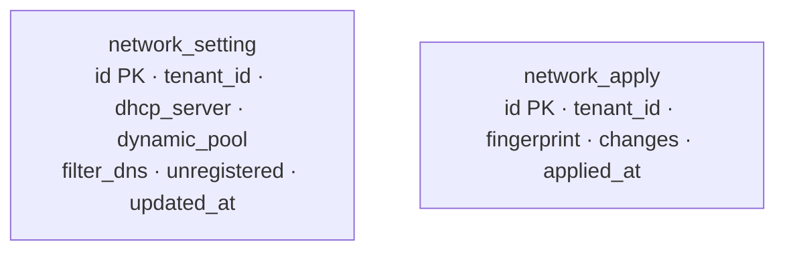

# network_manager — Database Diagram

- One `network_setting` row per tenant (`SaveSetting` replaces it). `unregistered`: `no_address` / `local`.
- `network_apply` is append-only history: one row per successful apply, newest first.
- Plan items, connections and discovered rows are never stored: they are computed from the gateway.
